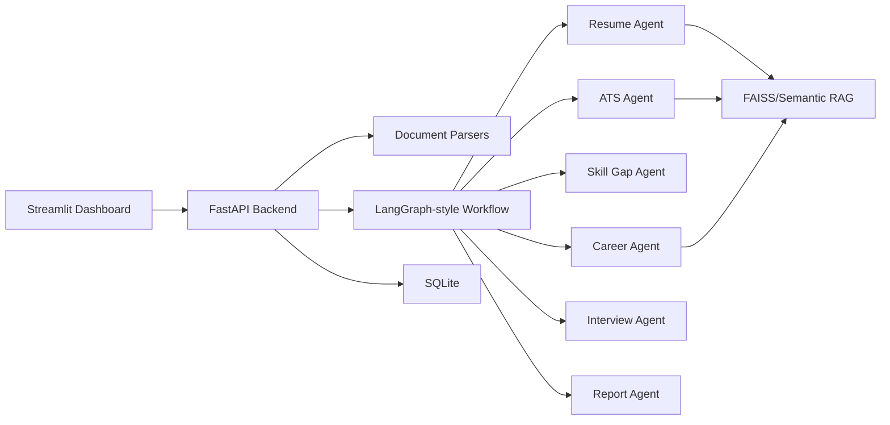

# AI Resume & Interview Coach

Portfolio-grade AI career copilot for resume intelligence, ATS optimization, job matching, skill-gap planning, and mock interview practice.

## Why This Project Stands Out

This project is built like a startup MVP, not a script. It demonstrates agentic AI architecture, retrieval-augmented generation, document parsing, scoring systems, structured outputs, API design, SQLite persistence, and a polished Streamlit dashboard.

The app runs locally with deterministic AI fallbacks, so reviewers can test it without paid API keys. Add Gemini or any OpenAI-compatible provider later through the orchestration layer.

## Core Features

- Resume upload and parsing for PDF, DOCX, and TXT
- Resume scoring across ATS, technical depth, leadership, projects, and employability
- ATS optimization report with missing keywords and stronger bullet rewrites
- Resume-to-job-description match analysis
- Career Coach Agent for projects, internships, certifications, and roadmap planning
- Skill Gap Agent for role-specific weekly learning plans
- Interview Simulator for HR, technical, behavioral, AI/ML, and product interviews
- Interview Feedback Agent for completeness, confidence, communication, and depth
- RAG knowledge base with chunking, retrieval, and context injection
- FastAPI backend plus Streamlit SaaS-style dashboard
- SQLite persistence for resumes, scores, interviews, and learning plans

## Architecture



## Folder Guide

- `agents/`: focused AI agents with clear responsibilities
- `analytics/`: scoring, keyword, and resume intelligence logic
- `backend/`: FastAPI application and API routes
- `database/`: SQLite schema and repository functions
- `embeddings/`: embedding provider abstractions
- `frontend/`: Streamlit dashboard
- `parsers/`: PDF, DOCX, and TXT extraction
- `rag/`: knowledge base, chunking, retrieval, and seed content
- `reports/`: generated report formatting utilities
- `tests/`: focused unit tests
- `workflows/`: multi-agent orchestration
- `docs/`: architecture, API, deployment, and interview talking points

## Quickstart

```powershell
python -m venv .venv
.\.venv\Scripts\Activate.ps1
pip install -r requirements.txt
python -m pytest
streamlit run app.py
```

Optional full AI stack:

```powershell
pip install -r requirements-ai.txt
```

The default install is intentionally lean for demos and deployment. `requirements-ai.txt` adds LangChain, LangGraph, FAISS, and Sentence Transformers for the advanced retrieval/orchestration stack.

FastAPI backend:

```powershell
uvicorn backend.main:app --reload --port 8000
```

## Environment

Copy `.env.example` to `.env` and add keys when you want hosted LLM behavior. The project works without keys using deterministic local logic.

## How The Agents Work

Each agent accepts structured context and returns typed Pydantic outputs. The workflow coordinates agents in this order:

1. Parse and normalize the resume.
2. Analyze profile strength and extract sections.
3. Run ATS and job matching.
4. Retrieve best-practice context from the RAG knowledge base.
5. Generate career roadmap and interview plan.
6. Assemble a recruiter-readable report.

This gives you a clean story for interviews: the app separates orchestration, retrieval, scoring, and presentation instead of putting everything into one prompt.

## ATS Scoring Logic

The scoring engine combines:

- Keyword coverage
- Quantified impact in bullet points
- Section completeness
- Technical skill breadth
- Leadership and ownership signals
- Project quality signals
- Resume formatting risk indicators

Scores are transparent and explainable, which is important for a career product because users need to understand why a recommendation was made.

## Deployment

Supported targets:

- Streamlit Cloud for the dashboard
- Render or Railway for FastAPI
- Docker for local and cloud deployment

See [docs/DEPLOYMENT.md](docs/DEPLOYMENT.md).

## Recruiter Pitch

Use this project to show that you can build AI systems beyond prompt demos: document ingestion, retrieval, multi-agent orchestration, structured evaluation, product UX, and deployment readiness.
